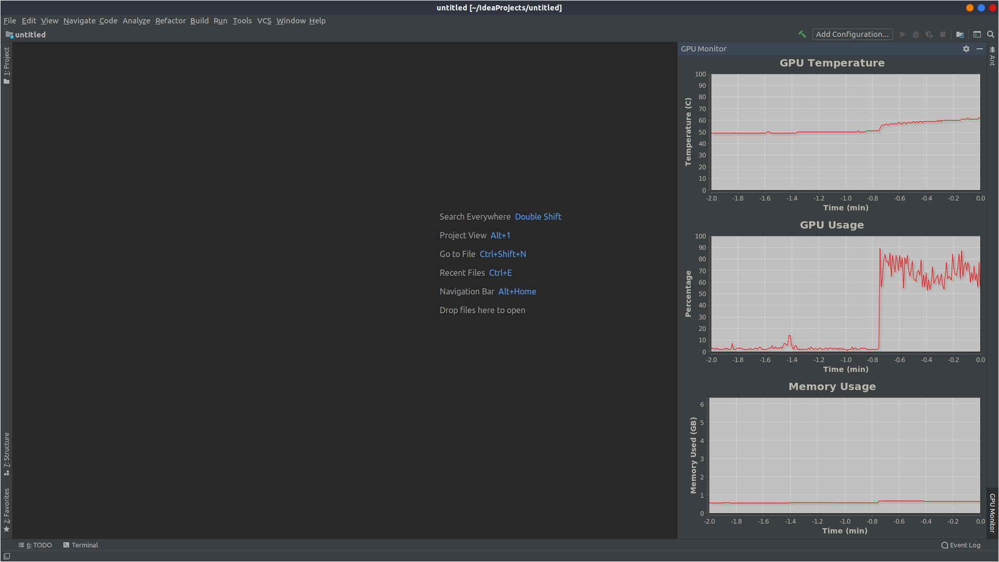

# GPU Monitor IntelliJ Plugin
This [IntelliJ plugin](https://plugins.jetbrains.com/plugin/13597-gpu-monitor) adds graphs for GPU temperature, usage, and memory usage in the right tool window.
You can customize which graphs show, how often they update, and how long ago they show. 
## Compatibility 
Compatible with all Jetbrains IDEs.
## Dependencies
This plugin uses nvidia-smi to poll the GPU data, which should be included in the nvidia drivers. This plugin also relies on JFreeChart to plot the graphs, which should be included. 
## Screenshots

